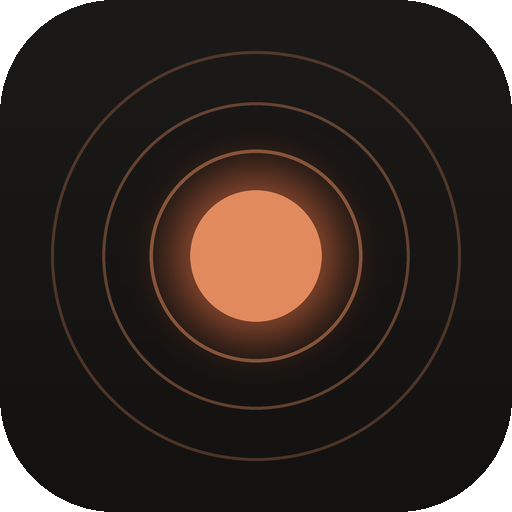
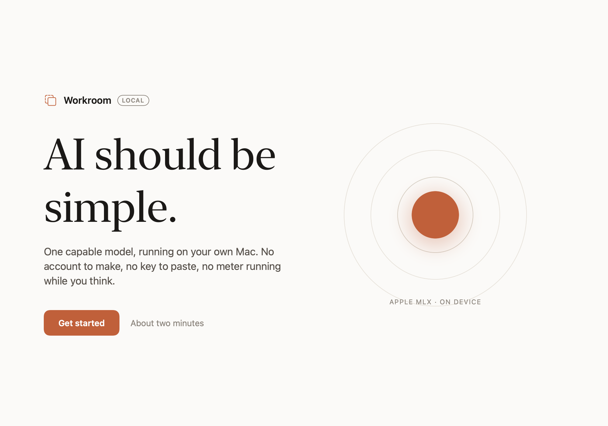
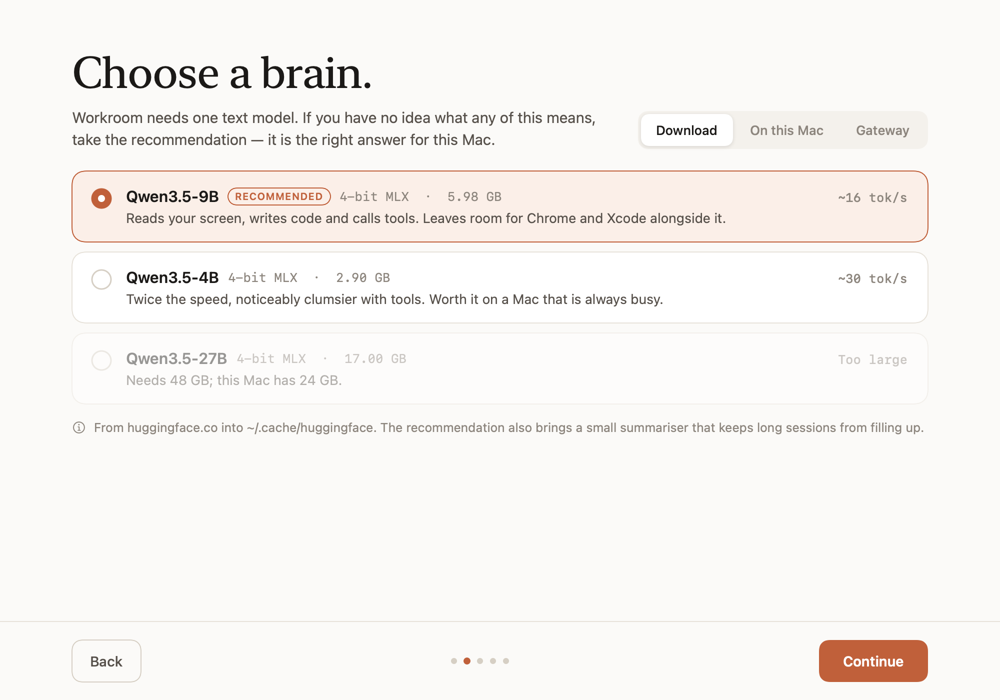
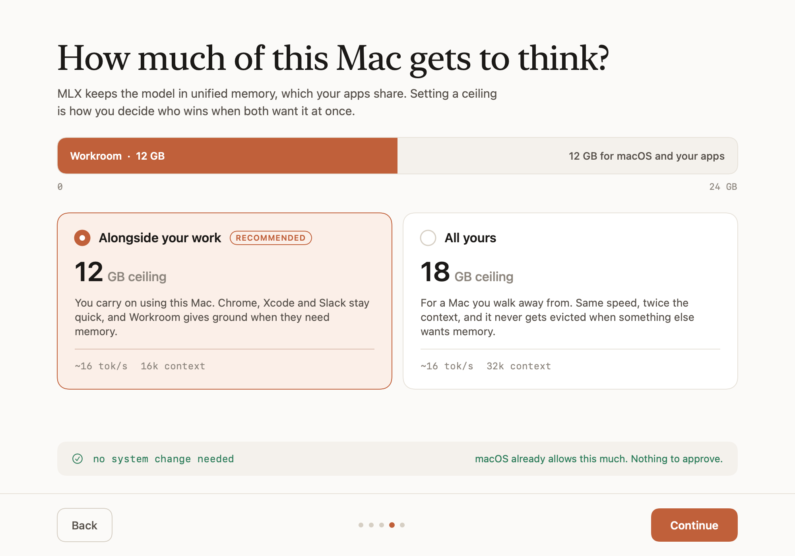

<div align="center">



# Workroom

**A computer-use agent that runs entirely on your Mac.**
One model reads the screen, runs commands and edits files. Nothing leaves the machine.

[](https://github.com/IAMIbrahimmemon/mlx-llm-workroom/actions/workflows/ci.yml)
[](LICENSE)
[](https://github.com/ml-explore/mlx)
[](https://github.com/IAMIbrahimmemon/mlx-llm-workroom/releases/latest)

[**Download the app**](https://iamibrahimmemon.github.io/mlx-llm-workroom/) ·
[Why local](#why-bother) ·
[How it works](#how-it-works) ·
[Contributing](CONTRIBUTING.md)

</div>

---



## Why bother

Most "local AI" setups ask you to pick a quantisation, guess a context length
and hope it fits in memory. Workroom asks two questions — which model, and how
much of your Mac it may use — and picks sensible answers for both if you would
rather not think about it.

- **Everything stays here.** Screenshots, keystrokes and file contents are
  handled in memory on your Mac. There is no server to trust, no account, no
  API key, no meter running while you think.
- **One model, not five.** `Qwen3.5-9B` reads your screen *and* writes your
  code, in a single 5.98 GB set of 4-bit MLX weights. No separate vision model
  to load, no JSON relay between them.
- **It tells you what it will cost.** Onboarding shows what the download is,
  what the memory ceiling means, and which of the two presets needs an admin
  password. (On a 24 GB Mac, one of them doesn't.)

## Install

The runtime is the same either way — the app is a friendlier front door onto it.

```sh
curl -LsSf https://astral.sh/uv/install.sh | sh     # if you don't have uv
git clone https://github.com/IAMIbrahimmemon/mlx-llm-workroom
cd mlx-llm-workroom && uv sync
uv run workroom          # onboards on first run, then drops into the REPL
```

Prefer the app? [Download the latest release][latest] as well. It finds the
folder above in the usual places and asks you to point at it otherwise.

> [!NOTE]
> The app is **not notarised** — this is a free project and Apple charges for a
> developer account. macOS will refuse to open it the first time: right-click
> it → **Open** → **Open**, once. Each release publishes a SHA-256 so you can
> check the download.

| command | what it does |
|---|---|
| `uv run workroom` | the REPL |
| `uv run workroom doctor` | chip, memory, installed models, which gateways answer |
| `uv run workroom onboard` | run setup again |
| `uv run workroom --dry-run` | show every action, take none |

## Requirements

Apple silicon, 16 GB unified memory or more, macOS 14+. Built and measured on
a base M3 with 24 GB.

## Already have models?

Onboarding finds them. Anything in your Hugging Face cache, anything you have
pulled with Ollama, and any OpenAI-compatible gateway already listening on
localhost — Ollama, LM Studio, llama.cpp, vLLM — is offered alongside the
download.



## How much of your Mac gets to think

On Apple silicon the model's weights and your browser tabs draw on the same
pool, so Workroom asks once where the ceiling goes.



| | ceiling on 24 GB | needs a password | for |
|---|---|---|---|
| **Alongside your work** | 12 GB, 16k context | no | you keep using the Mac |
| **All yours** | 18 GB, 32k context | yes, once per boot | you walk away and let it run |

Both run at the same speed. Decode is bound by memory *bandwidth*, not
capacity, so a higher ceiling buys context and stability under pressure — not
tokens per second. The presets are fractions of installed memory, so they work
the same on a 16 GB Air and a 128 GB Studio.

## Measured, not estimated

Base M3, 24 GB, 12 GB ceiling, `/no_think` — `uv run python scripts/bench_tps.py`:

| prompt | tok/s | peak memory |
|---|---|---|
| 1 000 | 16.3 | 6.54 GB |
| 8 000 | 16.8 | 7.70 GB |
| 16 000 | 15.7 | 8.48 GB |

Speed is flat from 1k to 16k — the hybrid Gated-DeltaNet layers do what they
promise, so a long context costs memory but not time. Model load from a warm
cache is about 7 seconds.

Running different hardware? [Send a number][hw] — every figure here comes from
one machine.

## How it works

```
REPL  →  loop.py  →  parse <tool_call>  →  guard  →  dispatch  →  <tool_result>  →  resume
                                            │
                          denied ·  asks you ·  allowed
```

- **`agent/brain.py`** — Qwen3.5-9B through `mlx-vlm`. Text, tool calls and
  images share one loader, one KV cache, one process.
- **`agent/toolcall.py`** — tolerant parser. The 4-bit quant pads every
  parameter with newlines; a strict parser stalls the agent on that alone.
- **`agent/actuation/guard.py`** — three verdicts: allowed, ask the human,
  never. See [SECURITY.md](SECURITY.md) for what sits in each.
- **`agent/memcap.py`** — holds the process to its ceiling through
  `mlx.set_memory_limit`, and only reaches for `sysctl` when the preset
  actually exceeds what macOS grants one process.
- **`agent/bridge.py`** — the single JSON surface the macOS app reads, so the
  app and the CLI can never disagree about what is on the menu.

```
agent/       runtime: brain, loop, tools, guard, discovery, memory ceiling
macapp/      SwiftUI onboarding app (Swift package + bundle.sh)
design/      onboarding artboards (.dc.html) and the canvas manifest
scripts/     model downloader, benchmarks, icon
tests/       parser and guard-rail tests
PLAN.md      the design record — decisions, and what measurement changed
```

## Status

Working: the agent loop, all six text and file tools, the guard rails, model
and gateway discovery, the memory ceiling, and the onboarding app end to end.

Not yet: the perception layer. `inspect_screen`, the accessibility-tree walk
and the Set-of-Mark vision path are designed in [PLAN.md](PLAN.md) (M3–M5) but
`agent/perception/` and `agent/actuation/actions.py` are still empty. Until
they land, Workroom is a very capable terminal agent that cannot yet click
anything.

## Licence

MIT — see [LICENSE](LICENSE). Model weights are Apache-2.0 from
[Qwen](https://huggingface.co/Qwen), fetched at runtime and never vendored here.

[latest]: https://github.com/IAMIbrahimmemon/mlx-llm-workroom/releases/latest
[hw]: https://github.com/IAMIbrahimmemon/mlx-llm-workroom/issues/new?template=hardware_report.yml
